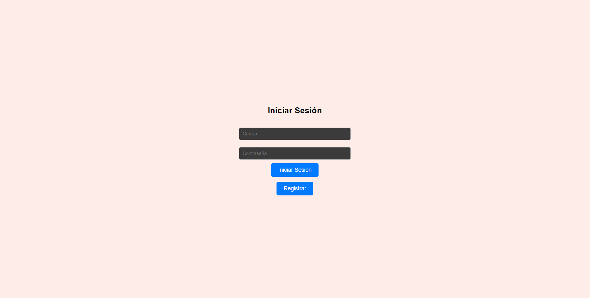
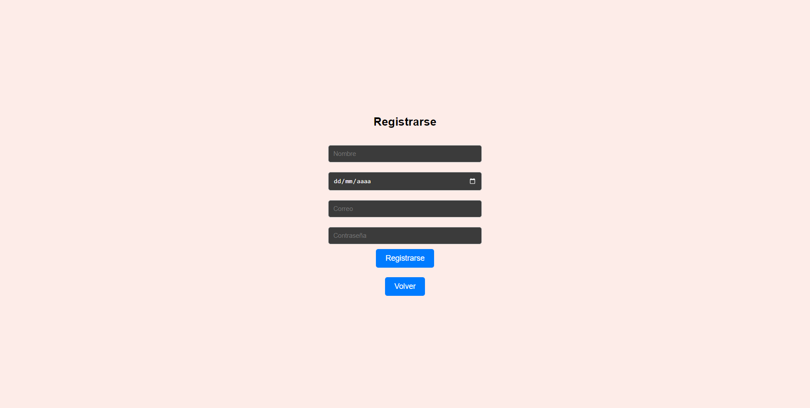
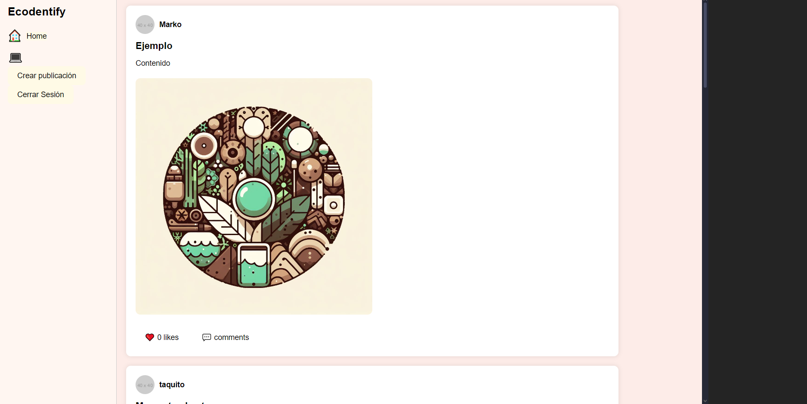
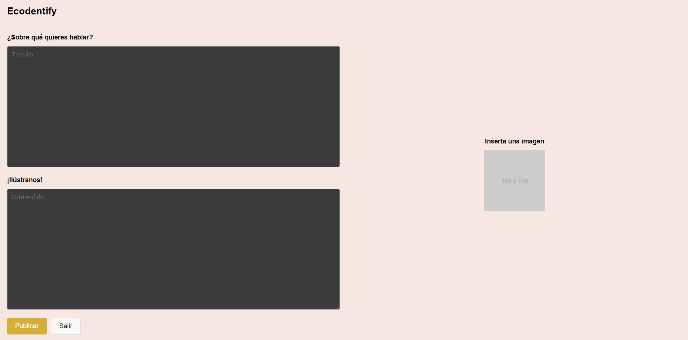
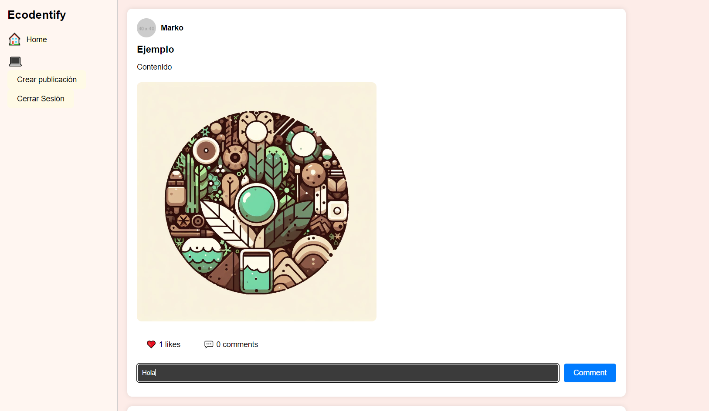
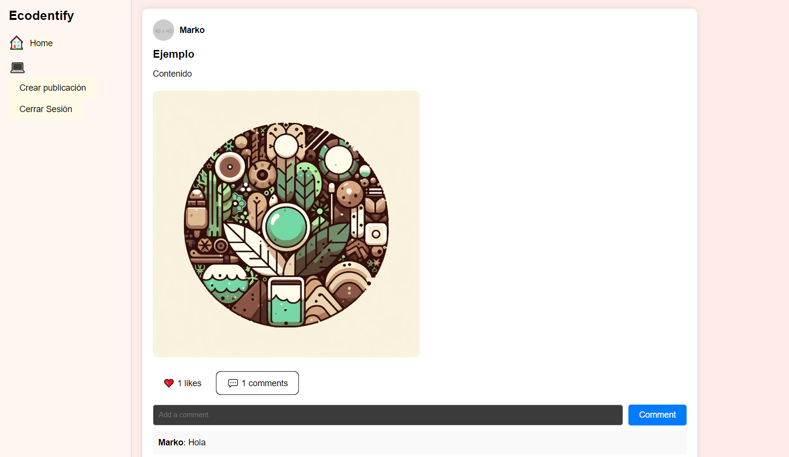

# Ecoidentify

## Descripción

Login, register, publish y feed de Ecoidentify, para interactuar con otros usuarios amantes de la naturaleza .

## Instrucciones de Instalación y Ejecución

### Requisitos Previos

- Tener instalado **Node.js(20.13.1)**
- **npm(10.7.0)**
- **XAMPP (8.2.12)**
- navegador (el de su preferencia, para esta practica se usó **Opera GX (109.0.5097.108)**)
- Editor de código(el de tu preferencia, para esta practica se utilizó **Visual Studio Code (1.89.1)**)
  
### Instalación

Pasos para instalar el proyecto:

1. Clonar este repositorio.
2. Instalar las dependencias utilizando **npm install** en las carpetas *Back* y *proyectoWeb*
   

### Ejecución

Pasos para ejecutar el proyecto:

1. Primero debemos abrir **XAMP** e iniciar apache y MySQL
2. Dar clic en *Admin* en el apartado de MySQL
3. Ir al apartado **SQL** que se ve en la parte superior y pegar la consulta sql que esta en la carpeta *Back*
4. Dar clic en *Continuar* para que se cree la base de datos
5. Para ejecutar el servidor necesitamos entrar a la carpeta *Back* y teclear en la terminal ``` npm start```
6. para iniciar nuestro proyecto vamos a la carpeta **proyectoWeb** y vamos a teclear en la terminal ```npm run dev```
7. Por ultimo da clic en las letras azules de localhost: http://localhost:5173/ para acceder a la página 
## Estructura del Proyecto

El proyecto se basa en un pequeña red social que permita la interacción de usuarios mediante publicaciones, donde estos podrán dar like o comentar sus publicaciones o las de otros para compartir sus gustos o conocimiento
El proyecto esta estrucurado de la siguiente manera
-   Backend
    -   En el bakend contamos con la configuración del servidor donde se incluyen los endpoints y la conección a la base de datos. **(server.js)**
    -   Se incluye el archivo sql de la base de datos **(basededatos.sql)**
    -   una carpeta **public/img** donde se guardan las fotos que los usuarios publican de manera local
-   Fontend
    -   Aquí contamos con los componentes 
        -   App.test.jsx el cual es el encargado de almacenar los tests que vamos a realizar
        -   ErrorPage.tsx El cual es el que entra en pantalla cuando se introduce una ruta no valida.
        -   Feed que es donde podemos ver e interactuar con las publicaciones de los demas usuarios
        -   Login que es donde podemos logearnos para iniciar sesión 
        -   Publish que es donde podemos hacer nuestras publicaciones
        -   Register que es donde nos podemos registrar par poder iniciar sesión
    -   El setup del test
        -   El cual se encarga de que las pruebas se ejecuten correctamente
    -   las rutas
        -   Son las encargadas de dar navegación a nuestra página
    -   el componente **App.tsx**
        -   Sobre el cual inicialmente se haría la navegación entre Feed y Pulish pero con la llegada de Login entró en desuso.

## Prototipos de la Vista y Manual de Uso


**Inicio de sesión**


Aquí podremos iniciar sesión si ya contamos con una cuenta , introduciendo el correo con el cual nos registramos y la contraseña, en caso de no tener una cuenta podemos dar clic en **Registrar** para ir a la página de registro.

**Registro**

Aquí nos podremos registrar introduciendo nuestros datos, una vez hemos terminado podemos dar clic en registrarse y nos devolvera a la página de login, en caso de que ya estemos registrados podemos dar clic en *Volver* y regresaremos a la página de login.

**Feed**

Aquí podremos ver las publicaciones de los otros usuarios, así como interactuar con dichas publicaciones mediante likes y comentarios, podremos navegar tambien a crear publicaciones o a cerrar nuestra sesión.

**Publish**

Aquí podremos crear nuestras publicaciones las cuales debene contener un titulo, contenido y opcionalmente una imagen , una vez ingrese los datos necesarios podras publicar tu contenido y posteriormente salir.

**Like**

Podras dar like a las publicaciones en el *corazón* o donde esta escrito *likes*

**Comments**

Podras comentar las publicaciones dando clic en *comments* y escribiendo tu comentario en el rectangulo negro, para publicarlo da clic en *Comment* y luego da clic nuevamente en comments para que se muestre.


## Pruebas

Se realizará una prueba de renderizado y de actualización  de estado sobre la pestaña de Login 

### Ejecución de Pruebas

Para ejecutar las pruebas es encesario entrar a la carpeta de proyecto Web y ejecutar en la terminalel comando ```run test```

### Descripción de las Pruebas

La primera prueba,verifica que el componente Login se renderiza correctamente y que los elementos clave están presentes en el DOM. Al renderizar el componente dentro de un Router, la prueba busca todos los elementos que contienen el texto 'Iniciar Sesión', asegurando que al menos uno de estos elementos esté presente. Además, la prueba confirma que los campos de entrada con los placeholders 'Correo' y 'Contraseña' están en el documento, así como un botón o enlace con el texto 'Registrar'. Esta verificación asegura que la interfaz de usuario básica del formulario de inicio de sesión esté correctamente montada y visible.

La segunda prueba,comprueba que los campos de entrada del formulario de inicio de sesión funcionan correctamente cuando un usuario introduce datos. Después de renderizar el componente Login dentro de un Router, la prueba utiliza fireEvent.change para simular la entrada de texto en los campos de Correo y Contraseña. Específicamente, introduce 'test@test.com' en el campo de correo y 'password123' en el campo de contraseña. Luego, la prueba verifica que los valores de estos campos se actualizan correctamente a los valores ingresados, asegurando que el estado interno del componente se maneje adecuadamente y que los campos de entrada respondan a la interacción del usuario como se espera.

